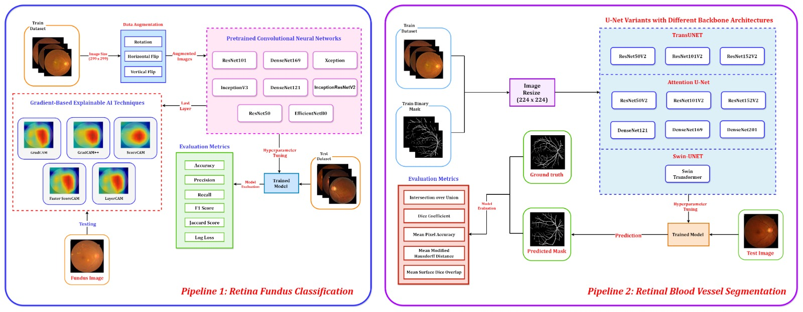

# Retinal-Fundus-Classification-using-XAI-and-Segmentation

## Abstract
Our research focuses on the critical field of early diagnosis of disease by examining retinal blood vessels in fundus images. While automatic segmentation of retinal blood vessels holds promise for early detection, accurate analysis remains challenging due to the limitations of existing methods, which often lack discrimination power and are susceptible to influences from pathological regions. Our research in fundus image analysis advances deep learning-based classification using eight pre-trained CNN models. To enhance interpretability, we utilize Explainable AI techniques such as Grad-CAM, Grad-CAM++, Score-CAM, Faster Score-CAM, and Layer CAM. These techniques illuminate the decision-making processes of the models, fostering transparency and trust in their predictions. Expanding our exploration, we investigate ten models, including TransUNet with ResNet backbones, Attention U-Net with DenseNet and ResNet backbones, and Swin-UNET. Incorporating diverse architectures such as ResNet50V2, ResNet101V2, ResNet152V2, and DenseNet121 among others, this comprehensive study deepens our insights into attention mechanisms for enhanced fundus image analysis. Among the evaluated models for fundus image classification, ResNet101 emerged with the highest accuracy, achieving an impressive 94.17\%. On the other end of the spectrum, EfficientNetB0 exhibited the lowest accuracy among the models, achieving a score of 88.33\%. Furthermore, in the domain of fundus image segmentation, Swin-Unet demonstrated a Mean Pixel Accuracy of 86.19\%, showcasing its effectiveness in accurately delineating regions of interest within fundus images. Conversely, Attention U-Net with DenseNet201 backbone exhibited the lowest Mean Pixel Accuracy among the evaluated models, achieving a score of 75.87\%. The presented findings contribute valuable insights to the performance and interpretability of deep learning models in fundus image analysis, offering advancements in medical image understanding and diagnosis.

## Table of Contents
- [Proposed Methodology](#experimental-methodology)
- [Experimental Setups](#experimental-setups)
- [Dataset Availability](#dataset-availability)
- [Results](#results)
- [Citation](#citation)
- [Contact Information](#contact-information)

## Proposed Methodology


## Experimental Setups

### Setup 1: Kaggle
- **Environment:**
  - Python Version: 3.11
  - PyTorch Version: 2.1.0
  - GPU: T4 GPU with 7.5 Compute Capability
  - RAM: 30 GB

### Setup 2: Jupyter Notebook Environment
- **Environment:**
  - Python Version: 3.10.12
  - PyTorch Version: 2.1.0
  - GPU: NVIDIA GeForce RTX 3050 (8 GB)
  - RAM: 16 GB
  - Storage: 512 GB NVMe SSD

### Setup 2: Jupyter Notebook Environment
- **Environment:**
  - Python Version: 3.10.12
  - Tensforflow Version: 2.6.0
  - GPU: NVIDIA GeForce RTX 3050 (8 GB)
  - RAM: 16 GB
  - Storage: 512 GB NVMe SSD
    
## Dataset Availability

The Comprehensive Potato Disease Dataset is now publicly accessible! This dataset, available in both jpg and png formats, offers a valuable resource for diverse research and analysis purposes. You can explore and download the dataset at the following link: [Dataset](https://github.com/Wasi34/Comprehensive-Potato-Disease-Dataset). Feel free to utilize this resource for your research, experiments, or any analytical endeavors. Should you have any questions or require further assistance with the dataset, please don't hesitate to reach out.


## Results
### Generated Potato Disease Realistic Image Evaluation Using Frechet Inception Distance and Inception Score

| **Class**      | **GANs**       | **Frechet Inception Distance** | **Inception Score** |
|----------------|----------------|--------------------------------|---------------------|
| Black Scurf    | Cycle GAN      | 0.4028                         | 1.2001              |
|                | Pix2Pix GAN    | 0.5743                         | 0.9899              |
| Common Scab    | Cycle GAN      | 0.4882                         | 1.0900              |
|                | Pix2Pix GAN    | 0.6240                         | 0.9643              |


### Performance Evaluation of Pretrained CNN for Potato Disease Classification

| **Model**            | **Accuracy** | **Precision** | **Recall** | **F1 Score** | **Log Loss** |
|----------------------|--------------|---------------|------------|--------------|--------------|
| DenseNet169         | 1.0000       | 1.0000        | 1.0000     | 1.0000       | 0.0024       |
| Resnet152V2         | 0.9804       | 0.9792        | 0.9821     | 0.9803       | 0.7067       |
| InceptionResNetV2   | 0.9902       | 0.9912        | 0.9891     | 0.9901       | 0.3533       |


### Performance Evaluation of Potato Disease Instance Segmentation

| **Backbone** | **Task Type** | **AP** | **\(AP_{IoU= 0.5}\)** | **\(AP_{IoU= 0.75}\)** | **Dice Score** |
|--------------|---------------|--------|-------------------------|-------------------------|----------------|
| ResNet-50    | Segmentation  | 73.204 | 89.733                  | 86.126                  | 0.6014         |
|              | Bounding Box  | 83.824 | 90.526                  | 86.353                  |                |
|--------------|---------------|--------|-------------------------|-------------------------|----------------|
| ResNet-101   | Segmentation  | 78.681 | 92.905                  | 74.851                  | 0.6728         |
|              | Bounding Box  | 87.886 | 96.409                  | 90.943                  |                |
|--------------|---------------|--------|-------------------------|-------------------------|----------------|
| ResNeXt-101  | Segmentation  | 86.039 | 97.030                  | 96.040                  | 0.8112         |
|              | Bounding Box  | 97.030 | 97.030                  | 97.030                  |                |


## Contact Information

For any questions, collaboration opportunities, or further inquiries, please feel free to reach out:

- **Fatema Tuj Johora Faria**
  - Email: [fatema.faria142@gmail.com](mailto:fatema.faria142@gmail.com)

- **Mukaffi Bin Moin**
  - Email: [mukaffi28@gmail.com](mailto:mukaffi28@gmail.com)

- **Ahmed Al Wase**
  - Email: [ahmed.alwasi34@gmail.com](mailto:ahmed.alwasi34@gmail.com)
    
## Citation

If you find the "Vashantor" dataset or the associated research work helpful, please consider citing our paper:

```bibtex
@misc{faria2023vashantor,
  title={Vashantor: A Large-scale Multilingual Benchmark Dataset for Automated Translation of Bangla Regional Dialects to Bangla Language},
  author={Fatema Tuj Johora Faria and Mukaffi Bin Moin and Ahmed Al Wase and Mehidi Ahmmed and Md. Rabius Sani and Tashreef Muhammad},
  year={2023},
  eprint={2311.11142},
  archivePrefix={arXiv},
  primaryClass={cs.CL}
}

